# IGIL Admin Dashboard User Guide

Version: 1.0  
Audience: Admin users  
Applies to: `app/admin`

## 1) What this dashboard is for

The Admin Dashboard helps you manage:

- Students and their profiles
- Enrollments and approvals
- Programs and program sessions
- Certificates and download unlocks
- Gallery images
- Your admin account settings

Use the left sidebar to move between sections:

- Dashboard
- Students
- Enrollments
- Programs
- Sessions
- Certificates
- Gallery Management
- Settings

## 2) Dashboard overview

Path: `/admin/dashboard`

The dashboard shows quick stats:

- Gallery Images: total image count
- Recent Activity: images added in the last 24 hours
- Storage Used: total gallery storage

Use this page as your quick health check before deeper actions.

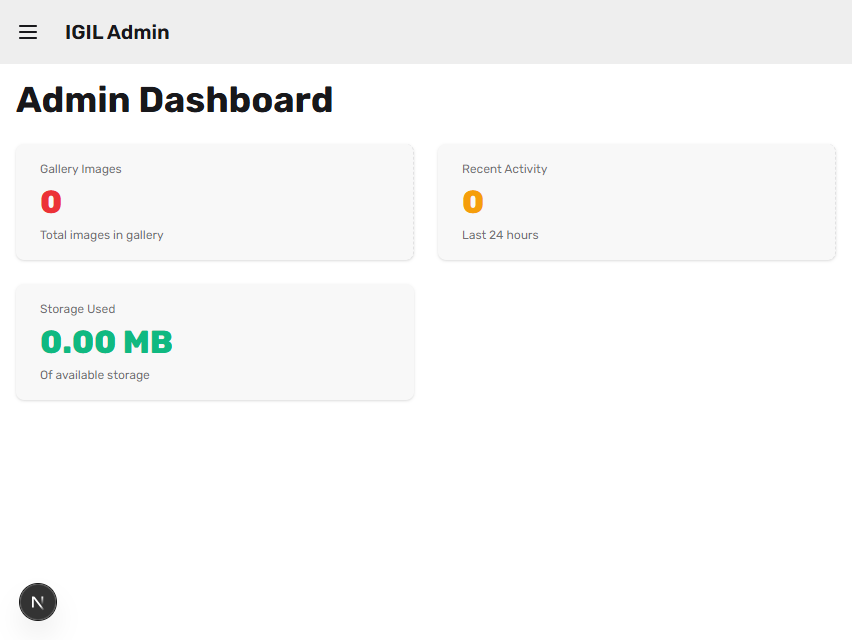

## 3) Students

Path: `/admin/students`

### What you can do

- Create a student manually
- Search students by name/email
- Filter by program
- Filter by profile approval status
- Open a student's profile page

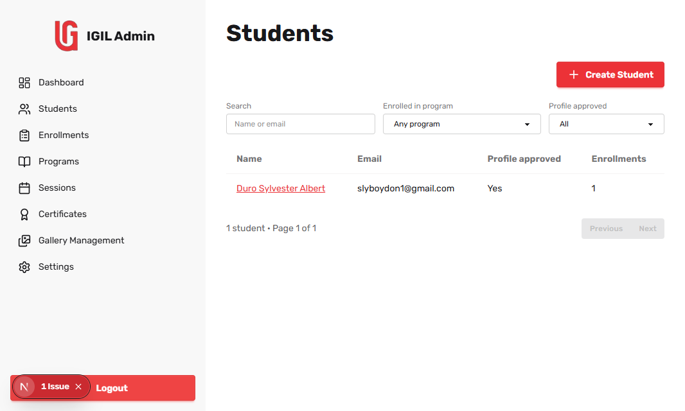

### Create a student

1. Click **Create Student**.
2. Fill in:
   - Name
   - Email
   - Temporary password (minimum 8 characters)
3. Optional:
   - Assign to a program
   - Enter program name for invite email
   - Keep **Send invitation email** checked if needed
4. Click **Create**.

Expected result: the student appears in the list and can be opened from name/email.

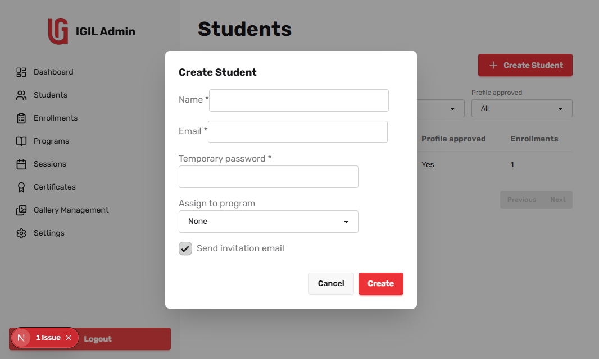

### Student profile page

Path: `/admin/students/{id}`

Use this page to review student details and enrollment status summary.

## 4) Enrollments

List path: `/admin/enrollments`  
Detail path: `/admin/enrollments/{id}`

### What you can do from the list

- Filter by Program
- Filter by Program session
- Filter by Source (`invited` or `self`)
- Search student by name/email
- Open **Details** for any enrollment

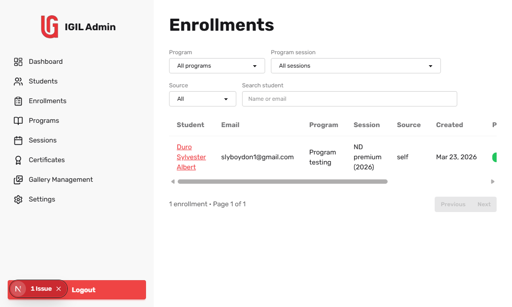

### Enrollment detail workflow (most important)

On the detail page, process enrollments in this order:

1. Confirm **Student** and **Program**.
2. Set **Program approved** if requirements are met.
3. Set **Payment approved** after payment verification.
4. Assign a **Session** (required before completion).
5. Check **Mark enrollment complete**.

Expected result: enrollment status reaches completed state.

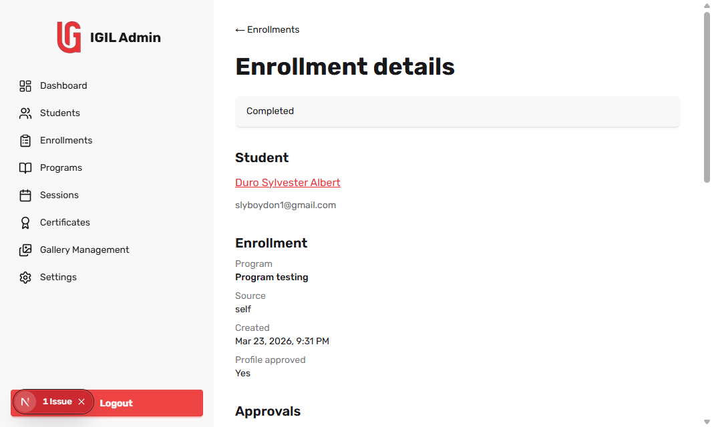

### Certificate actions from enrollment detail

After completion, a Certificate section appears.

You can:

- Upload certificate file (PDF/image)
- Set certificate number
- Set issued date
- Save certificate details

## 5) Programs

List path: `/admin/programs`  
Create path: `/admin/programs/new`  
Edit path: `/admin/programs/{id}/edit`

### What you can do

- Create a new program
- Edit program details
- Delete a program

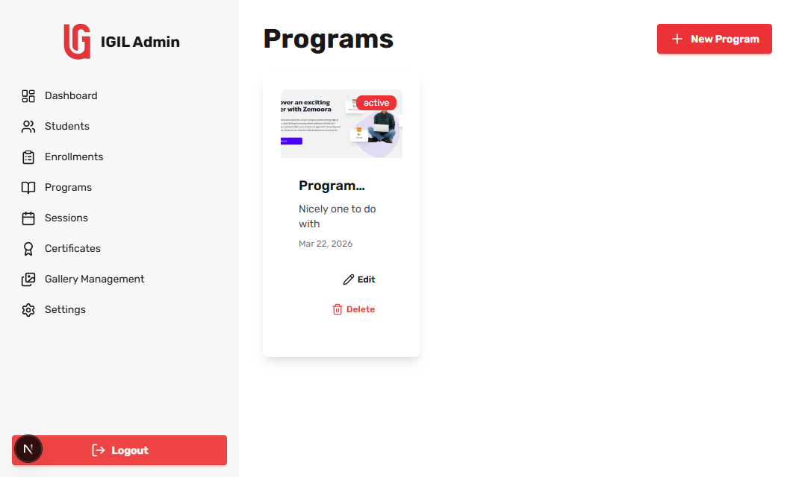

### Create or edit a program

Fill:

- Title (required)
- Description (required)
- Cover image (optional upload)
- Payment instruction (optional)
- Status (`draft` or `active`)

Click **Create** or **Update** to save.

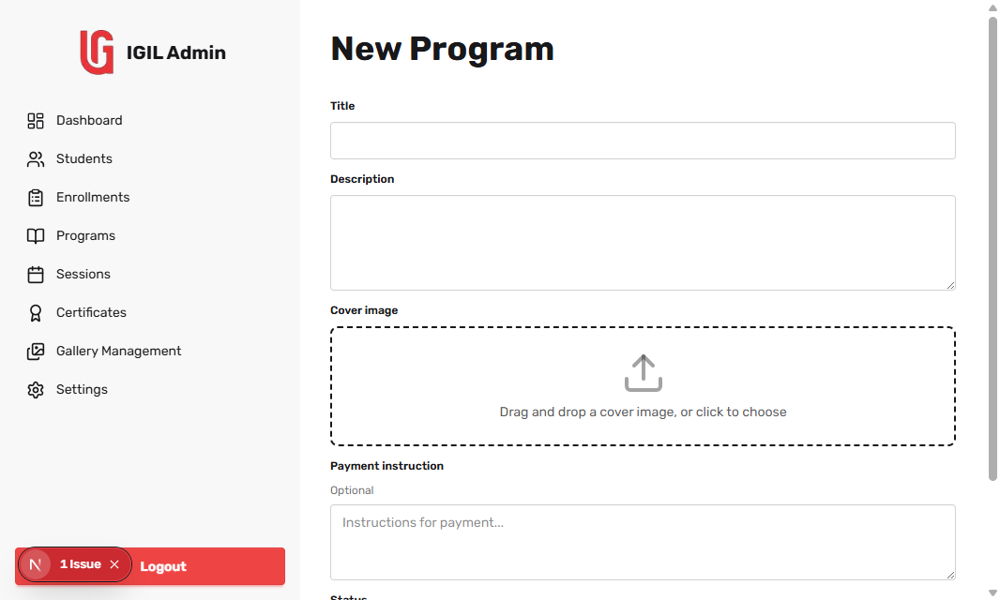

### Delete a program

1. Click **Delete** on a program card.
2. Confirm deletion in the prompt.

Use caution: deleting affects program availability and related operations.

## 6) Sessions

List path: `/admin/sessions`  
Manage students path: `/admin/sessions/{id}`

### Create a session

1. Click **New Session**.
2. Select Program.
3. Set Year and Title.
4. Click **Create**.

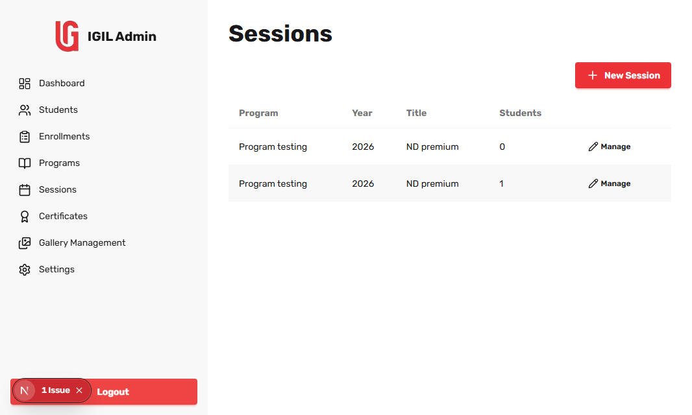

### Manage session students

1. Click **Manage** on a session row.
2. On the session page:
   - Search by name or user ID
   - Filter by **Program approved**
   - Filter by **In this session**
3. Check/uncheck **In session** per student.
4. Click **Save changes**.

Expected result: session membership updates and session student count refreshes.

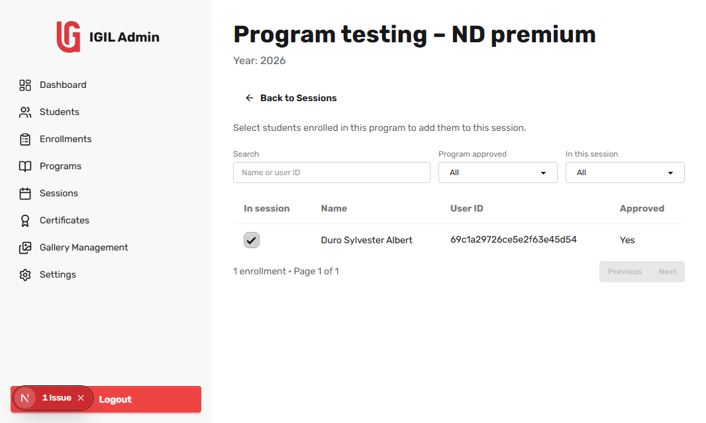

## 7) Certificates

Path: `/admin/certificates`

### What you can do

- View certificate records by user/program/session
- Review certificate number and file link
- See student download count
- See unlock expiry
- Unlock student downloads for 24 hours

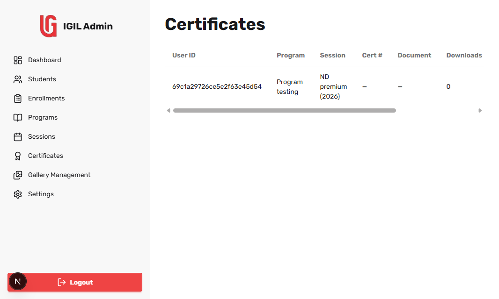

### Unlock workflow

1. Locate the certificate row.
2. Click **Unlock 24h**.

Expected result: unlock end time updates and student can download during the unlock period.

## 8) Gallery Management

Path: `/admin/gallery`

### What you can do

- Upload new images
- Edit image metadata
- Delete images
- Browse with pagination

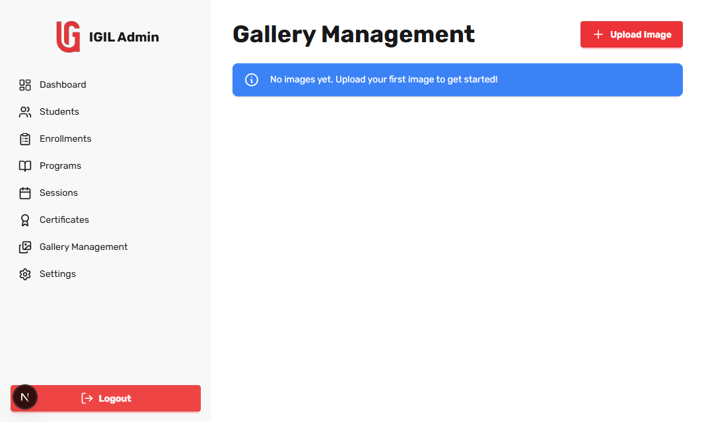

### Recommended flow

1. Upload image from **Upload** action.
2. Verify title/description and thumbnail.
3. Use edit action to fix metadata.
4. Use delete only when content is obsolete.

## 9) Settings

Path: `/admin/settings`

### Change email

1. Enter current email.
2. Enter new email and confirmation.
3. Click **Change Email**.

### Change password

1. Enter current password.
2. Enter new password and confirmation (minimum 8 characters).
3. Click **Change Password**.

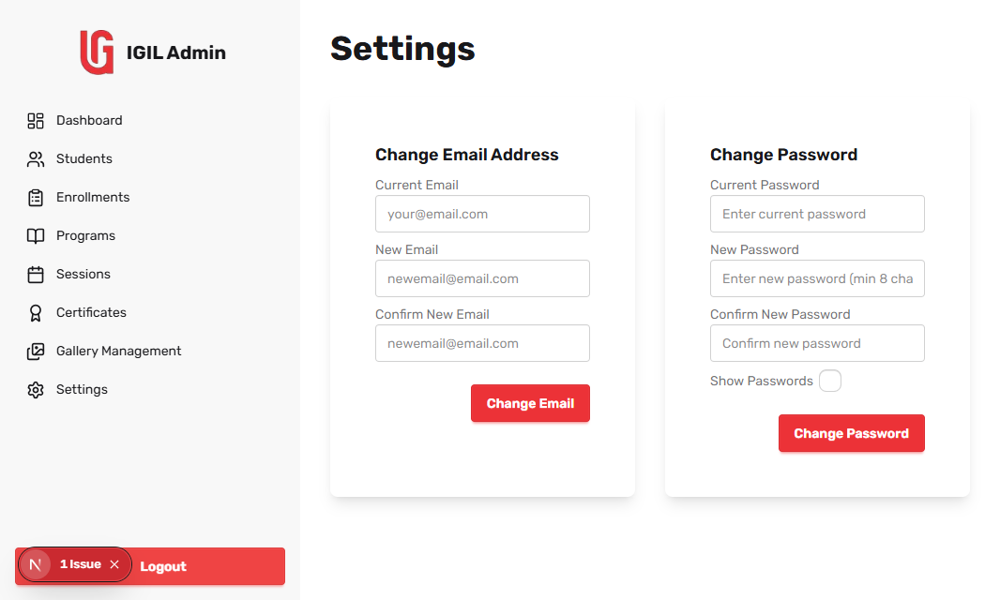

## 10) Common messages and what they mean

- **No students/enrollments/sessions yet**: no data for current state; create records first.
- **No records match current filters**: clear some filters or search terms.
- **Program and title are required**: missing required session fields.
- **Assign a session before marking complete**: set session first in enrollment detail.

## 11) Best-practice checklist

- Approve in sequence: profile -> program -> payment -> completion.
- Always assign session before marking completion.
- Keep program titles and session titles clear and consistent.
- Add certificate number and issue date immediately after upload.
- Use filters before editing to avoid modifying the wrong record.

## 12) Screenshot index

Store screenshots under: `docs/admin-guide/screenshots/`

Planned files:

- `01-dashboard.png`
- `02-students-list.png`
- `03-create-student-modal.png`
- `04-enrollments-list.png`
- `05-enrollment-detail-approvals.png`
- `06-programs-cards.png`
- `07-program-form.png`
- `08-sessions-list.png`
- `09-session-students-manage.png`
- `10-certificates-table.png`
- `11-gallery-management.png`
- `12-settings-forms.png`
